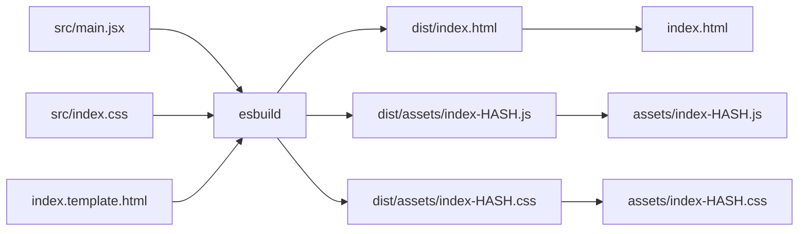
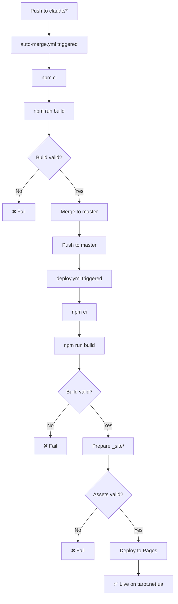

# 🚀 Deployment Guide | Гід з Деплою

## 📋 Зміст

1. [Як працює деплой](#як-працює-деплой)
2. [Як задеплоїти зміни](#як-задеплоїти-зміни)
3. [Перевірка статусу деплою](#перевірка-статусу-деплою)
4. [Troubleshooting](#troubleshooting)
5. [Архітектура](#архітектура)

---

## 🔄 Як працює деплой

Проєкт використовує **автоматизований pipeline деплою** з трьох етапів:

```
1️⃣ Push до claude/* → 2️⃣ Auto-merge to master → 3️⃣ Deploy to GitHub Pages
   (auto-merge.yml)           (auto-merge.yml)          (deploy.yml)
```

### Етап 1: Push до claude/* гілки
- Ви пушите зміни до будь-якої гілки `claude/*`
- GitHub Actions автоматично запускає `auto-merge.yml`

### Етап 2: Build і Auto-merge
- `auto-merge.yml` запускає `npm run build`
- Валідує, що білд успішний (перевіряє наявність hashed assets)
- Автоматично мерджить в `master` якщо все ОК
- Використовує retry logic для push (до 4 спроб)

### Етап 3: Deploy to GitHub Pages
- Push в `master` тригерить `deploy.yml`
- Знову запускає build для впевненості
- Валідує output (перевіряє `index.html`, assets, розкладки)
- Деплоїть на GitHub Pages (tarot.net.ua)

---

## 📤 Як задеплоїти зміни

### Простий спосіб (рекомендований):

```bash
# 1. Зробіть зміни в коді
# 2. Закомітьте зміни
git add .
git commit -m "✨ Опис змін"

# 3. Push до claude/* гілки
git push -u origin claude/ваша-гілка-011CUzHtzftriztDR7DVmErv

# 4. Все! Деплой піде автоматично 🎉
```

### Що відбувається далі:

1. ⏳ **Auto-merge** (~2-3 хв): Білд + merge в master
2. ⏳ **Deploy** (~2-3 хв): Build + deploy на Pages
3. ✅ **Live** (~30 сек): Зміни на tarot.net.ua

**Загальний час: ~5-7 хвилин**

---

## 🔍 Перевірка статусу деплою

### 1. Через GitHub Actions

1. Відкрийте https://github.com/Evanengell/evanengell.github.io/actions
2. Знайдіть свій workflow:
   - `Auto-merge to Master on Success` - етап 1-2
   - `Deploy to GitHub Pages` - етап 3
3. Перевірте статус (✅ зелений = успіх, ❌ червоний = помилка)

### 2. Через командний рядок

```bash
# Перевірити що на master
git log master --oneline -5

# Перевірити що на поточній гілці
git log --oneline -5
```

### 3. Перевірити live сайт

```bash
# Швидка перевірка через curl
curl -s https://tarot.net.ua | grep -o "index-[a-z0-9]*\.js"

# Має вивести щось на кшталт: index-d6814581.js
```

**Або через браузер:**
1. Відкрийте https://tarot.net.ua
2. Натисніть `Ctrl+Shift+R` (або `Cmd+Shift+R` на Mac) для hard refresh
3. Відкрийте DevTools (F12) → Network → перевірте що JS/CSS файли з hash

---

## 🔧 Troubleshooting

### ❌ Проблема: "Зміни не видно на сайті"

**Причина 1: Кеш браузера**
```bash
# Рішення:
- Натисніть Ctrl+Shift+R (hard refresh)
- Або відкрийте в incognito/private mode
```

**Причина 2: Деплой ще не завершився**
```bash
# Рішення:
- Перевірте GitHub Actions (має пройти ~5-7 хв)
- Дочекайтеся зеленої галочки ✅
```

**Причина 3: Зміни не в master**
```bash
# Рішення:
git checkout master
git pull origin master
git log --oneline -5  # перевірте чи є ваш коміт

# Якщо немає - push знову:
git checkout claude/ваша-гілка
git push origin claude/ваша-гілка
```

---

### ❌ Проблема: "Auto-merge failed"

**Причина: Merge conflict**

```bash
# Рішення:
# 1. Fetch останні зміни
git fetch origin master

# 2. Merge master в вашу гілку
git merge origin/master

# 3. Resolve conflicts
# 4. Commit і push знову
git add .
git commit -m "🔧 Resolved merge conflicts"
git push origin claude/ваша-гілка
```

---

### ❌ Проблема: "Build failed"

**Причина: Помилка в коді або залежностях**

```bash
# Рішення:
# 1. Перевірте локально
npm ci
npm run build

# 2. Подивіться на помилки
# 3. Виправте код
# 4. Push знову
```

---

### ❌ Проблема: "Push failed 403"

**Причина: Неправильна назва гілки**

```bash
# Рішення:
# Гілка ПОВИННА починатися з 'claude/' та містити session ID

# ❌ Неправильно:
git push origin my-feature

# ✅ Правильно:
git push origin claude/my-feature-011CUzHtzftriztDR7DVmErv
```

---

## 🏗️ Архітектура

### Структура проєкту

```
evanengell.github.io/
├── .github/workflows/
│   ├── auto-merge.yml      # Auto-merge claude/* → master
│   └── deploy.yml          # Deploy master → Pages
├── src/                    # React source code
│   ├── main.jsx           # Entry point
│   └── index.css          # Styles
├── build.js               # Build script (esbuild)
├── index.template.html    # HTML template
├── dist/                  # Build output (generated)
│   ├── index.html        # Generated HTML with hashed assets
│   └── assets/           # Generated JS/CSS
├── index.html            # Root HTML (copied from dist/)
├── assets/               # Root assets (copied from dist/assets/)
└── rozklady/            # Generated spread pages
```

### Build Process



### Deploy Pipeline



---

## 📝 Best Practices

1. **Завжди тестуйте локально перед push:**
   ```bash
   npm run build
   npm run preview
   ```

2. **Пишіть описові commit messages:**
   ```bash
   git commit -m "✨ Додано нову функцію X"
   git commit -m "🐛 Виправлено баг Y"
   git commit -m "🔧 Оновлено конфігурацію Z"
   ```

3. **Перевіряйте статус після push:**
   - Перейдіть на https://github.com/Evanengell/evanengell.github.io/actions
   - Дочекайтеся зеленої галочки ✅

4. **Hard refresh після deploy:**
   - Завжди робіть `Ctrl+Shift+R` після деплою
   - Або відкрийте в incognito mode

---

## 🎯 Швидка перевірка

```bash
# Чек-лист після deploy:
□ GitHub Actions показує ✅ для обох workflows
□ git log master показує ваш коміт
□ curl -s https://tarot.net.ua | grep "index-[a-z0-9]*\.js" показує hash
□ Сайт працює в браузері (після Ctrl+Shift+R)
```

---

## 📞 Підтримка

Якщо виникли проблеми:

1. Перевірте [Troubleshooting](#troubleshooting)
2. Подивіться логи GitHub Actions
3. Запустіть локально `npm run build` для діагностики

---

**Останнє оновлення:** 2025-11-10
**Версія:** 2.0 - Покращений механізм деплою з валідацією
